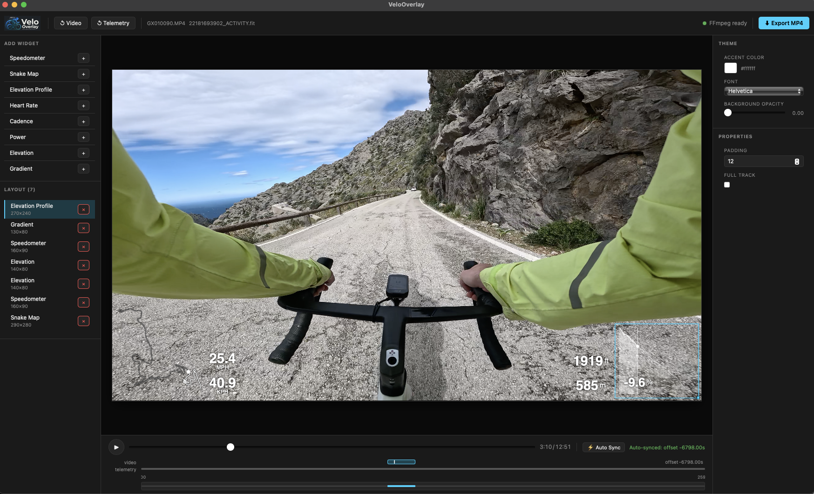

<p align="center">
  
</p>

Open source software for synchronizing cycling telemetry (GPS, HR, power, cadence, etc) with POV video and rendering customizable widget overlays.

<p align="center">
  
</p>

**License:** MIT

---

## Prerequisites

### Rust (required for CLI and desktop app)

```bash
# Install Rust via rustup (the official installer)
curl --proto '=https' --tlsv1.2 -sSf https://sh.rustup.rs | sh

# Verify installation
cargo --version
```

### Node.js (required for desktop app and widget SDK)

Install Node.js 20+ via [nodejs.org](https://nodejs.org) or:

```bash
brew install node
```

### FFmpeg (required for video rendering)

```bash
# macOS
brew install ffmpeg

# Windows — see https://ffmpeg.org/download.html
```

---

## Quick start

### Desktop app (GUI)

```bash
# Install JS dependencies (monorepo workspaces)
npm install

# Run the Tauri desktop app in dev mode
cd app
cargo tauri dev
```

When you launch the app:

- **Import Video**: choose an MP4 from your camera.
- **Import Telemetry**: choose a `.fit` activity (Garmin / Wahoo / etc.).
- **Edit layout**: add widgets, position them, tweak settings.
- **Export MP4**: renders and re-encodes the final video (requires FFmpeg).

### CLI

```bash
# Build the CLI
cargo build -p velooverlay

# Show help
cargo run -p velooverlay -- --help
```

If you prefer an installed binary (local checkout):

```bash
cargo install --path crates/velo-cli
velooverlay --help
```

## Repository Structure

```
velooverlay/
├── crates/
│   ├── velo-core/        # Rust library: telemetry parsing, sync, interpolation
│   └── velo-cli/         # CLI binary: `velooverlay` command
├── app/
│   ├── src-tauri/        # Tauri Rust backend
│   └── src/              # React/TypeScript frontend
└── packages/
    ├── widget-sdk/        # TypeScript widget interface (published to npm)
    └── widgets-builtin/   # Built-in widgets (Speedometer, Snake Map, HR, Cadence, Power)
```

---

## Development Setup

```bash
# Clone the repo
git clone https://github.com/velooverlay/velooverlay.git
cd velooverlay

# Install Node dependencies (all workspaces)
npm install

# Check the Rust workspace compiles
cargo check

# Build the widget SDK and built-in widgets
npm run build --workspace=packages/widget-sdk
npm run build --workspace=packages/widgets-builtin
```

---

## CLI Usage (Phase 0)

Build and run the CLI:

```bash
cargo build --package velooverlay

# Or run directly without a separate build step:
cargo run --package velooverlay -- --help
```

### Sync modes

Both `process` and `render` support two sync modes, controlled by `--sync`:

| Mode | Flag | Behaviour |
|---|---|---|
| **Auto** (default) | `--sync auto` | Reads the `creation_time` tag from the video file and the `start_time` from the telemetry file and computes the offset automatically. Requires both files to contain embedded timestamps (GoPro, DJI, and Garmin devices all do). Falls back to `--offset-ms 0` with a warning if either timestamp is missing. |
| **Manual** | `--sync manual --offset-ms <MS>` | Uses a fixed millisecond offset you provide. Positive = telemetry starts after the video; negative = telemetry starts before the video (the typical case when the video is a clip from mid-ride). |

### Commands

**process** — Parse telemetry, apply sync, interpolate to frame rate, export as JSON or CSV:

```bash
# Auto-sync using embedded timestamps (recommended)
cargo run --package velooverlay -- process \
  --telemetry ride.fit \
  --video ride.mp4 \
  --fps 30 \
  --format json \
  --output telemetry.json

# Manual offset — telemetry started 5.2 seconds before the video
cargo run --package velooverlay -- process \
  --telemetry ride.fit \
  --video ride.mp4 \
  --sync manual \
  --offset-ms -5200 \
  --fps 30 \
  --format csv \
  --output telemetry.csv

# No video — uses telemetry duration, outputs the full session
cargo run --package velooverlay -- process \
  --telemetry ride.fit \
  --fps 30 \
  --format json \
  --output telemetry.json
```

**render** — Burn widget overlay onto video (requires FFmpeg):

```bash
# Auto-sync (recommended)
cargo run --package velooverlay -- render \
  --video ride.mp4 \
  --telemetry ride.fit \
  --layout layout.json \
  --output output.mp4

# Manual offset
cargo run --package velooverlay -- render \
  --video ride.mp4 \
  --telemetry ride.fit \
  --layout layout.json \
  --sync manual \
  --offset-ms -5200 \
  --output output.mp4

# Reduce output file size (higher CRF = smaller file, lower quality)
cargo run --package velooverlay -- render \
  --video ride.mp4 \
  --telemetry ride.fit \
  --layout layout.json \
  --crf 28 \
  --output output.mp4
```

**Output file size:** The render command re-encodes the video stream (unavoidable when compositing). The default `--crf 23` matches FFmpeg's built-in default and may produce a larger file than your source if the original was recorded in H.265 or at a lower bitrate. Use `--crf 28` for a noticeably smaller file at slightly lower quality, or `--crf 18` for near-lossless output.

| `--crf` | Quality | Typical use |
|---|---|---|
| 18 | Near-lossless | Archiving, further editing |
| 23 | Default (good) | General sharing |
| 28 | Smaller file | Web upload, messaging |
| 35+ | Noticeably degraded | Not recommended |

### Layout file

The `--layout` argument points to a `layout.json` file that describes which widgets to show and where. See [`examples/layout.json`](examples/layout.json) for a full example.

Built-in widget types (used in `layout.json` under each widget's `config` object):

| Type | Config (JSON keys) | Rendered by CLI export (`velooverlay render` / GUI Export MP4)? |
|---|---|---|
| `builtin:speedometer` | `{"unit": "kph" \| "mph"}` (default: `kph`) | Yes |
| `builtin:heart-rate` | `{}` (no options) | Yes |
| `builtin:cadence` | `{}` (no options) | Yes |
| `builtin:power` | `{}` (no options) | Yes |
| `builtin:snake-map` | `{"full_track": true \| false}` (default: `false`) | Yes |
| `builtin:elevation-profile` | `{"full_track": true \| false}` (default: `false`) | Yes |
| `builtin:elevation` | `{"unit": "m" \| "ft"}` (GUI preview only; see note below) | No |
| `builtin:gradient` | `{"windowM": number}` (GUI preview only; see note below) | No |

Note: the GUI may expose additional per-widget options (for example, `padding`) that are not currently consumed by the Rust CLI renderer. If you’re preparing a `layout.json` for CLI export, prefer the keys listed above.

---

## Desktop App (Phase 1)

```bash
# Run in development mode (hot-reload)
cd app
cargo tauri dev

# Build a release binary
cd app
cargo tauri build
```

---

## Building a Widget

Install the SDK:

```bash
npm install @velooverlay/widget-sdk
```

Implement the `WidgetDefinition` interface:

```typescript
import { WidgetDefinition, WidgetRenderContext } from '@velooverlay/widget-sdk';

export const MyWidget: WidgetDefinition = {
  id: 'com.yourname:my-widget',
  name: 'My Widget',
  version: '1.0.0',
  defaultSize: { width: 200, height: 100 },
  getDefaultConfig: () => ({}),
  render(ctx: WidgetRenderContext): void {
    const c = ctx.canvas.getContext('2d')!;
    c.fillStyle = ctx.theme.primaryColor;
    c.fillText(`${ctx.frame.speedMs?.toFixed(1) ?? '--'} m/s`, 10, 50);
  },
};
```

---

## Contributing

Pull requests welcome. Please open an issue first for significant changes.
